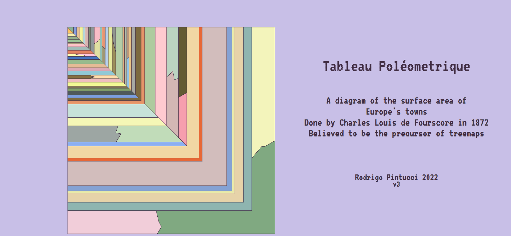

# Visualização da Informação
## Exemplo histórico
#### Professora: Asla Medeiros e Sá
#### Aluno: Rodrigo Gomes Hutz Pintucci
#### 2022

Segundo trabalho da disciplina de Visualização da Informação, ministrada pela professora Asla Medeiros e Sá. Desta vez, a tarefa era recriar uma visualização histórica. A escolha foi uma representação das áreas dos países da Europa, feita em 1872 por Charles Louis de Fourscore. A visualização original pode ser encontrada [aqui](https://www.highcharts.com/blog/tutorials/156-tableau-poleometrique/).

Devido à unicidade da visualização, decidi representá-lo utilizando SVG. Também adicionei animações em CSS e JavaScript para dar um toque de interatividade. 

#HTML
Temos abaixo o código HTML: 

```html
<!DOCTYPE html>
<html>
    <meta charset ="UTF-8"/>
<head>
    <title>Tableau Poléometrique</title>
    <link rel="icon" href="https://rodrigopintucci.github.io/Tabby/tabbyena3.png">
    <link href="animation.css" rel="stylesheet"/>
</head>
<body>

<?xml version="1.0"?>
<svg class="principal" xmlns="http://www.w3.org/2000/svg" version="1.1" xmlns:xlink="http://www.w3.org/1999/xlink" width="2000px" height="1000px">
    <g class="shapes01">
        <rect x="0" y="0" width="946" height="946" fill="rgb(128,169,129)"/>
        <polygon points="840,0 946,0 946,520 900,546 886,546 840,600" fill="rgb(243,244,187)"/>
        <polygon points="0,840 404,840 416,890 428,914 410,946 0,946" fill="rgb(241,205,217)"/>
    </g>
    <g class="shapes02">
        <rect x="0" y="0" width="840" height="840" fill="rgb(142,181,176)"/>
    </g>
    <g class="shapes03">
        <rect x="0" y="0" width="802" height="802" fill="rgb(230,211,169)"/>
    </g>
    <g class="shapes04">
        <rect x="0" y="0" width="760" height="760" fill="rgb(231,233,168)"/>
    </g>
    <g class="shapes05">
        <rect x="0" y="0" width="750" height="750" fill="rgb(132,162,212)"/>
    </g>
    <g class="shapes06"> 
        <rect x="0" y="0" width="726" height="726" fill="rgb(210,189,188)"/>
    </g>
    <g class="shapes07">
        <rect x="0" y="0" width="614" height="614" fill="rgb(231,103,54)"/>
    </g>
    <g class="shapes08">
        <rect x="0" y="0" width="600" height="600" fill="rgb(241,215,164)"/>
    </g>
    <g class="shapes09">
        <polygon points="0,0 0,544 544,544" fill="rgb(140,175,241)"/>
        <polygon points="0,0 544,0 544,544" fill="rgb(246,158,174)"/>
        <polygon points="506,0 544,0 544,300 506,322" fill="rgb(99,90,51)"/>
    </g>
    <g class="shapes10">
        <polygon points="0,0 0,526 526,526" fill="rgb(193,220,185)"/>
        <polygon points="0,0 506,0 506,506" fill="rgb(211,183,180)"/>
        <polygon points="452,0 506,0 506,234 488,242 480,200 452,232" fill="rgb(187,212,193)"/>
        <polygon points="0,452 0,526 222,526 244,488 220,484 230,452" fill="rgb(157,166,163)"/>
    </g>
    <g class="shapes11">
        <polygon points="0,0 0,452 452,452" fill="rgb(245,247,182)"/>
        <polygon points="0,0 452,0 452,452" fill="rgb(255,202,208)"/>
    </g>
    <g class="shapes12">
        <polygon points="0,0 0,414 414,414" fill="rgb(199,226,217)"/>
        <polygon points="0,0 400,0 400,400" fill="rgb(174,203,159)"/>
        <rect x="0" y="0" width="352" height="352" fill="rgb(230,149,104)"/>
    </g>
    <g class="shapes13">
        <rect x="0" y="0" width="336" height="336" fill="rgb(124,105,63)"/>
        <polygon points="0,0 0,324 324,324" fill="rgb(124,158,222)"/>
    </g>
    <g class="shapes14">
        <polygon points="0,0 0,310 310,310" fill="rgb(79,89,90)"/>
        <polygon points="0,0 310,0 310,310" fill="rgb(168,169,164)"/>
    </g>
    <g class="shapes15"> rgb(0,0,0)
        <polygon points="0,0 0,292 292,292" fill="rgb(130,160,106)"/>
        <polygon points="0,0 292,0 292,292" fill="rgb(234,196,134)"/>
    </g>
    <g class="shapes16">
        <polygon points="0,0 0,280 280,280" fill="rgb(127,113,87)"/>
        <polygon points="0,0 280,0 280,280" fill="rgb(144,196,233)"/>
        <polygon points="270,0 280,0 280,136 270,146" fill="rgb(185,151,123)"/>
    </g>
    <g class="shapes17">
        <polygon points="0,0 0,270 270,270" fill="rgb(242,248,148)"/>
        <polygon points="0,0 270,0 270,270" fill="rgb(181,193,173)"/>
        <polygon points="0,0 260,0 260,260" fill="rgb(228,175,131)"/>
    </g>
    <g class="shapes18">
        <polygon points="0,0 0,252 252,252" fill="rgb(240,190,191)"/>
        <polygon points="0,0 0,236 236,236" fill="rgb(255,223,173)"/>
        <polygon points="0,0 252,0 252,252" fill="rgb(180,206,167)"/>
        <polygon points="0,220 0,236 108,236 106,232 128,228 106,224 108,220" fill="rgb(134,112,65)"/>
    </g>
    <g class="shapes19">
        <polygon points="0,0 0,220 220,220" fill="rgb(145,201,214)"/>
        <polygon points="0,0 220,0 220,220" fill="rgb(156,143,90)"/>
        <polygon points="200,0 220,0 220,114 210,76" fill="rgb(145,150,143)"/>
    </g>
    <g class="shapes20">
        <polygon points="0,0 0,200 200,200" fill="rgb(221,169,182)"/>
        <polygon points="0,0 204,0 204,204" fill="rgb(230,234,157)"/>
    </g>
    <g class="shapes21">
        <polygon points="0,0 0,186 186,186" fill="rgb(229,187,149)"/>
        <polygon points="0,0 186,0 186,186" fill="rgb(184,209,237)"/>
    </g>
    <g class="shapes22">
        <polygon points="0,0 0,168 168,168" fill="rgb(151,187,141)"/>
        <polygon points="0,0 172,0 172,172" fill="rgb(159,151,115)"/>
        <polygon points="0,0 158,0 158,158" fill="rgb(145,192,182)"/>
        <polygon points="158,0 172,0 172,100 158,86" fill="rgb(229,149,114)"/>
    </g>
    <g class="shapes23">
        <polygon points="0,0 0,148 148,148" fill="rgb(68,117,194)"/>
        <polygon points="0,0 0,134 134,134" fill="rgb(255,199,223)"/>
        <polygon points="0,0 148,0 148,148" fill="rgb(224,224,162)"/>
        <polygon points="122,0 148,0 148,54 140,60 140,64 134,68 122,76" fill="rgb(248,188,198)"/>
        <polygon points="0,122 0,134 86,134 72,128 56,128 28,122" fill="rgb(255,255,178)"/>
    </g>
    <g class="shapes24">
        <polygon points="0,0 0,122 122,122" fill="rgb(227,130,98)"/>
        <polygon points="0,0 122,0 122,122" fill="rgb(143,151,153)"/>
    </g>
    <g class="shapes25">
        <polygon points="0,0 0,106 106,106" fill="rgb(162,189,184)"/>
        <polygon points="0,0 0,90 90,90" fill="rgb(255,194,199)"/>
        <polygon points="0,0 0,78 78,78" fill="rgb(166,151,122)"/>
        <polygon points="0,0 106,0 106,106" fill="rgb(124,144,117)"/>
        <polygon points="0,0 96,0 96,96" fill="rgb(215,180,176)"/>
        <polygon points="0,0 80,0 80,80" fill="rgb(177,211,213)"/>
    </g>
    <g class="shapes26">
        <polygon points="0,0 0,70 70,70" fill="rgb(156,198,150)"/>
        <polygon points="0,0 70,0 70,70" fill="rgb(243,243,155)"/>
    </g>
    <g class="shapes27">
        <polygon points="0,0 0,56 56,56" fill="rgb(150,176,139)"/>
        <polygon points="0,0 56,0 56,56" fill="rgb(230,193,148)"/>
    </g>
    <g class="shapes28">
        <polygon points="0,0 0,42 42,42" fill="rgb(248,240,175)"/>
        <polygon points="0,0 42,0 42,42" fill="rgb(133,156,223)"/>
    </g>
    <g class="shapes29">
        <polygon points="0,0 0,28 28,28" fill="rgb(255,195,95)"/>
        <polygon points="0,0 28,0 28,28" fill="rgb(139,178,151)"/>
    </g>
    <g class="texts">
        <text x="1500" y="200" font-size="80" fill="rgb(64, 44, 66)">Tableau Poléometrique</text>
        <text x="1500" y="350" font-size="50" fill="rgb(64, 44, 66)">A diagram of the surface area of</text>
        <text x="1500" y="400" font-size="50" fill="rgb(64, 44, 66)">Europe's towns</text>
        <text x="1500" y="450" font-size="50" fill="rgb(64, 44, 66)">Done by Charles Louis de Fourscore in 1872</text>
        <text x="1500" y="500" font-size="50" fill="rgb(64, 44, 66)">Believed to be the precursor of treemaps</text>
        <text x="1500" y="700" font-size="45" fill="rgb(64, 44, 66)">Rodrigo Pintucci 2022</text>
        <text x="1500" y="730" font-size="40" fill="rgb(64, 44, 66)">v3</text> 
    </g>
</svg>


    <!-- adds interaction.js as a javascript script -->
    <script type="text/javascript" src="interaction.js"></script>
    <!-- <footer>Rodrigo Pintucci 2022</footer> -->
</body>
</html>
```

Podemos dividir esse código em 3 partes:

  1. A primeira parte trata do cabeçalho do HTML, onde temos a declaração do tipo de documento, a declaração do charset, título da página, favicon e estilo CSS.
  2. A segunda parte trata do corpo do HTML, onde temos a declaração dos elementos SVG e a declaração dos textos. Cada elemento SVG possui uma classe que será utilizada para identificar o elemento para a animação.
  3. A terceira parte trata do rodapé do HTML, onde temos a declaração do script de interação.

Como não encontrei a base de dados que originou a visualização, dividi a imagem original em quadrados e triângulos, todos com origens em (0,0). Depois, criei um SVG para cada, começando da camada mais abaixo, ou seja, do quadrado de maior área. Utilizando uma ferramenta de edição de imagens [no meu caso, o Paint :.) ], fui capaz de identificar a cor de cada elemento e também suas dimensões. Dividi os elementos em 29 classes, para me facilitar no momento de fazer a animação.

#CSS

Para não ficar muito monótono, gostaria que, quando a página fosse iniciada, a visualização começasse a se construir, da menor parte até a maior. Dessa forma, criei um código CSS que faz com que os elementos SVG sejam exibidos de forma gradual. Para que cada camada seja mostrada em um tempo diferente, fiz com que a porcentagem que condiz com seu tempo de início combinasse com a porcentagem que condiz com o tempo de finalização da camada anterior. 
Devido à natureza do CSS, tive de aplicar esse método para cada uma das 29 classes, tornando assim o código CSS muito extenso:

```css
/* importação da fonte */

@font-face {
    font-family: 'VT323';
    font-style: normal;
    font-weight: 400;
    src: url(https://fonts.gstatic.com/s/vt323/v17/pxiKyp0ihIEF2isfFJU.woff2) format('woff2');
    unicode-range: U+0000-00FF, U+0131, U+0152-0153, U+02BB-02BC, U+02C6, U+02DA, U+02DC, U+2000-206F, U+2074, U+20AC, U+2122, U+2191, U+2193, U+2212, U+2215, U+FEFF, U+FFFD;
}

/* fundo  */
body {
    background: rgb(200,191,231);
    background: -webkit-linear-gradient(rgb(200,191,231), rgb(200,191,231));
    background: -o-linear-gradient(rgb(200,191,231), rgb(200,191,231));
    background: -moz-linear-gradient(rgb(200,191,231), rgb(200,191,231));
    background: linear-gradient(rgb(200,191,231), rgb(200,191,231));
    background-size: cover;
    background-attachment: fixed;
    background-position: center;
    background-repeat: no-repeat;
    font-family: 'VT323';
    font-size: 22px;
    color: rgb(64, 44, 66);
    margin: 0;
    padding: 0;
    stroke: rgb(64, 44, 66);
    stroke-width: var(--stroke-width); 
}

.principal{
    scale: 0.65;
    transform-origin: 0 0;
    translate: 200px 100px;
}

/* texto */
.texts{
    scale: 1;
    stroke: rgb(64, 44, 66);
    stroke-width: 1px;
    fill: rgb(64, 44, 66);
    font-size: 22px;
    font-family: 'VT323';
    text-anchor: middle;
}

/* atribuição das classes */
.shapes01{
    animation: scale01 10s 1;
}
.shapes02{
    animation: scale02 10s 1;
}
.shapes03{
    animation: scale03 10s 1;
}
.shapes04{
    animation: scale04 10s 1;
}
.shapes05{
    animation: scale05 10s 1;
}
.shapes06{
    animation: scale06 10s 1;
}
.shapes07{
    animation: scale07 10s 1;
}
.shapes08{
    animation: scale08 10s 1;
}
.shapes09{
    animation: scale09 10s 1;
}
.shapes10{
    animation: scale10 10s 1;
}
.shapes11{
    animation: scale11 10s 1;
}
.shapes12{
    animation: scale12 10s 1;
}
.shapes13{
    animation: scale13 10s 1;
}
.shapes14{
    animation: scale14 10s 1;
}
.shapes15{
    animation: scale15 10s 1;
}
.shapes16{
    animation: scale16 10s 1;
}
.shapes17{
    animation: scale17 10s 1;
}
.shapes18{
    animation: scale18 10s 1;
}
.shapes19{
    animation: scale19 10s 1;
}
.shapes20{
    animation: scale20 10s 1;
}
.shapes21{
    animation: scale21 10s 1;
}
.shapes22{
    animation: scale22 10s 1;
}
.shapes23{
    animation: scale23 10s 1;
}
.shapes24{
    animation: scale24 10s 1;
}
.shapes25{
    animation: scale25 10s 1;
}
.shapes26{
    animation: scale26 10s 1;
}
.shapes27{
    animation: scale27 10s 1;
}
.shapes28{
    animation: scale28 10s 1;
}
.shapes29{
    animation: scale29 10s 1;
}

/* animação das classes */

@keyframes scale01 {
    0% {
        transform: scale(0%);
    }
    84% {
        transform: scale(0%);
    }
    87% {
        transform: scale(100%);
    }
}

@keyframes scale02 {
    0% {
        transform: scale(0%);
    }
    81% {
        transform: scale(0%);
    }
    84% {
        transform: scale(100%);
    }
}

@keyframes scale03 {
    0% {
        transform: scale(0%);
    }
    78% {
        transform: scale(0%);
    }
    81% {
        transform: scale(100%);
    }
}

@keyframes scale04 {
    0% {
        transform: scale(0%);
    }
    75% {
        transform: scale(0%);
    }
    78% {
        transform: scale(100%);
    }
}

@keyframes scale05 {
    0% {
        transform: scale(0%);
    }
    72% {
        transform: scale(0%);
    }
    75% {
        transform: scale(100%);
    }
}

@keyframes scale06 {
    0% {
        transform: scale(0%);
    }
    69% {
        transform: scale(0%);
    }
    72% {
        transform: scale(100%);
    }
}

@keyframes scale07 {
    0% {
        transform: scale(0%);
    }
    66% {
        transform: scale(0%);
    }
    69% {
        transform: scale(100%);
    }
}

@keyframes scale08 {
    0% {
        transform: scale(0%);
    }
    63% {
        transform: scale(0%);
    }
    66% {
        transform: scale(100%);
    }
}

@keyframes scale09 {
    0% {
        transform: scale(0%);
    }
    60% {
        transform: scale(0%);
    }
    63% {
        transform: scale(100%);
    }
}

@keyframes scale10 {
    0% {
        transform: scale(0%);
    }
    57% {
        transform: scale(0%);
    }
    60% {
        transform: scale(100%);
    }
}

@keyframes scale11 {
    0% {
        transform: scale(0%);
    }
    54% {
        transform: scale(0%);
    }
    57% {
        transform: scale(100%);
    }
}

@keyframes scale12 {
    0% {
        transform: scale(0%);
    }
    51% {
        transform: scale(0%);
    }
    54% {
        transform: scale(100%);
    }
}

@keyframes scale13 {
    0% {
        transform: scale(0%);
    }
    48% {
        transform: scale(0%);
    }
    51% {
        transform: scale(100%);
    }
}

@keyframes scale14 {
    0% {
        transform: scale(0%);
    }
    45% {
        transform: scale(0%);
    }
    48% {
        transform: scale(100%);
    }
}

@keyframes scale15 {
    0% {
        transform: scale(0%);
    }
    42% {
        transform: scale(0%);
    }
    45% {
        transform: scale(100%);
    }
}

@keyframes scale16 {
    0% {
        transform: scale(0%);
    }
    39% {
        transform: scale(0%);
    }
    42% {
        transform: scale(100%);
    }
}

@keyframes scale17 {
    0% {
        transform: scale(0%);
    }
    36% {
        transform: scale(0%);
    }
    39% {
        transform: scale(100%);
    }
}

@keyframes scale18 {
    0% {
        transform: scale(0%);
    }
    33% {
        transform: scale(0%);
    }
    36% {
        transform: scale(100%);
    }
}

@keyframes scale19 {
    0% {
        transform: scale(0%);
    }
    30% {
        transform: scale(0%);
    }
    33% {
        transform: scale(100%);
    }
}

@keyframes scale20 {
    0% {
        transform: scale(0%);
    }
    27% {
        transform: scale(0%);
    }
    30% {
        transform: scale(100%);
    }
}

@keyframes scale21 {
    0% {
        transform: scale(0%);
    }
    24% {
        transform: scale(0%);
    }
    27% {
        transform: scale(100%);
    }
}

@keyframes scale22 {
    0% {
        transform: scale(0%);
    }
    21% {
        transform: scale(0%);
    }
    24% {
        transform: scale(100%);
    }
}

@keyframes scale23 {
    0% {
        transform: scale(0%);
    }
    18% {
        transform: scale(0%);
    }
    21% {
        transform: scale(100%);
    }
}

@keyframes scale24 {
    0% {
        transform: scale(0%);
    }
    15% {
        transform: scale(0%);
    }
    18% {
        transform: scale(100%);
    }
}

@keyframes scale25 {
    0% {
        transform: scale(0%);
    }
    12% {
        transform: scale(0%);
    }
    15% {
        transform: scale(100%);
    }
}

@keyframes scale26 {
    0% {
        transform: scale(0%);
    }
    9% {
        transform: scale(0%);
    }
    12% {
        transform: scale(100%);
    }
}

@keyframes scale27 {
    0% {
        transform: scale(0%);
    }
    6% {
        transform: scale(0%);
    }
    9% {
        transform: scale(100%);
    }
}

@keyframes scale28 {
    0% {
        transform: scale(0%);
    }
    3% {
        transform: scale(0%);
    }
    6% {
        transform: scale(100%);
    }
}

@keyframes scale29 {
    0% {
        transform: scale(0%);
    }
    3% {
        transform: scale(100%);
    }
}
```

Também podemos dividir o código em partes, para que fique mais fácil de entender:

  1. A importação da fonte `VT323` e a definição do estilo de alguns elementos, como o `body` e algumas classes.
  2. A atribuição das classes a suas respectivas animações.
  3. A definição das animações.

  # Javascript

  Ao contrário do último trabalho, este leva o mínimo de Javascript possível. Ele foi utilizado apenas para definir o tamanho da grossura das linhas do gráfico. Isso é feito de acordo com a posição do mouse, que é capturada pelo evento `mousemove` e atribuída a uma variável, então utilizada para definir a propriedade `stroke-width` do SVG.

  ```javascript	
  let root = document.documentElement;

    root.addEventListener("mousemove", e => {
        root.style.setProperty("--stroke-width", e.clientX/1000);
        }
    );
```

  # Resultado final

Este foi o resultado final da página:


Para comparações, segue a visualização original:


Segue também a imagem de um camarão muito bonito:

